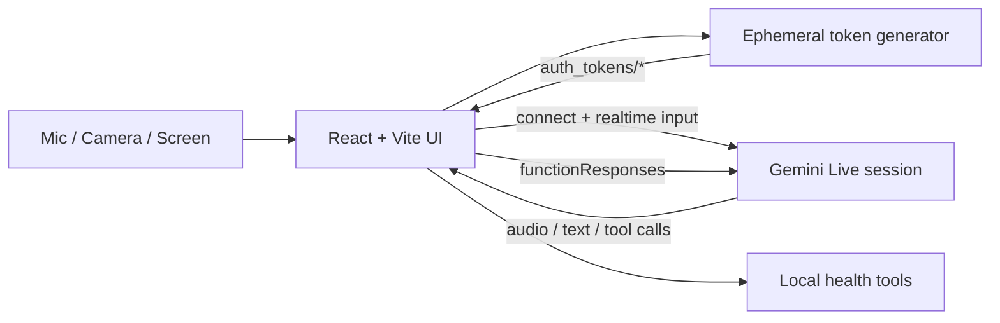

# Gemini Live UI

A browser-based voice assistant playground built on the Google GenAI Live API.

This repo is a multimodal, low-latency health-coach prototype with:

- real-time audio in and audio out
- optional webcam and screen streaming into the live session
- editable system instructions
- configurable voice, transcription, and VAD behavior
- local tool calling for appointment lookup and booking
- ephemeral Live auth token generation from the app itself

The default assistant persona is "Maya", a practical health and lifestyle coach that can speak in English or Hindi/Hinglish and use local appointment-booking tools when needed.

## What You Get

- Live Gemini session management from the browser
- Audio capture at 16 kHz PCM through an `AudioWorklet`
- Streaming audio playback at 24 kHz PCM through a second `AudioWorklet`
- Camera frame streaming at 1 FPS as JPEG
- Screen-share frame streaming at 0.5 FPS as JPEG
- Input and output transcription toggles
- Adjustable activity detection and interruption behavior
- Google grounding toggle
- Tool-call debugging and raw setup payload visibility

## Product Flow

The main UI has three views:

1. `Playground`
   Connect, talk, type, share your camera, or share your screen.
2. `System`
   Edit the assistant's system prompt without cluttering the conversation UI.
3. `Settings`
   Choose voice/device options, tune session behavior, and inspect debug logs plus the generated setup JSON.

Typical session flow:

1. Add a Google API key to `.env`
2. Start the app with `pnpm dev`
3. Click `Generate Token`
4. Click `Connect`
5. Wait for `setupComplete`
6. Start voice input, type a message, or stream camera/screen data

## Architecture



Core modules:

- `src/App.jsx`: main UI, session lifecycle, media toggles, message log, settings pages
- `src/lib/gemini-live.js`: fixed model, Live config builder, session connection helper
- `src/lib/ephemeral-token.js`: creates ephemeral auth tokens using `VITE_API_KEY`
- `src/lib/audio.js`: microphone capture and streamed PCM playback
- `src/lib/video.js`: webcam and screen frame capture
- `src/lib/tools.js`: local health/booking tool definitions and execution
- `src/systemPrompt.js`: default Maya persona and safety guidance

## Quick Start

### Prerequisites

- a current Node.js installation
- `pnpm`
- a Google API key that can create GenAI auth tokens and access Live sessions
- a browser with `getUserMedia`, `getDisplayMedia`, and `AudioWorklet` support

### Install

```bash
pnpm install
```

### Configure

Create `.env` in the project root:

```bash
VITE_API_KEY=your_google_api_key
```

The app reads this value from `import.meta.env.VITE_API_KEY`.

### Run

```bash
pnpm dev
```

Then open the local Vite URL in your browser.

### First Session

1. Click `Generate Token`
2. Click `Connect`
3. Wait until the status changes from connecting to ready
4. Start talking, send a text message, enable webcam, or share your screen

## Auth Model

This project uses a two-step auth flow:

1. A long-lived Google API key is loaded from `VITE_API_KEY`
2. The browser calls `authTokens.create(...)` to mint an ephemeral Live token
3. The returned token name, which looks like `auth_tokens/...`, is stored in local storage
4. That ephemeral token is then used to open the Live session

Important details from the current implementation:

- the local storage key is `goals-live-ephemeral-token`
- generated tokens default to long lifetimes in this prototype:
  - `expireMinutes = 1140`
  - `newSessionExpireMinutes = 1140`
- when the server closes a session because the token can no longer start new sessions, the UI asks you to generate a new token and reconnect

## Production Caveat

This repo is a research playground, not a production-ready auth architecture.

`VITE_API_KEY` is a Vite client environment variable, which means it is bundled into the browser app. That is acceptable for a quick prototype, but not for a real deployment. In production, token minting should move to a trusted backend and the browser should never receive the long-lived API key.

## Runtime Behavior

### Live Session Defaults

- fixed model: `gemini-3.1-flash-live-preview`
- response modality: audio
- voice options: `Puck`, `Charon`, `Kore`, `Fenrir`, `Aoede`
- turn coverage: audio activity plus all video
- optional input transcription
- optional output transcription

### Media Streaming

- microphone audio is captured as mono 16 kHz PCM
- assistant audio is played back as 24 kHz PCM
- webcam frames are sampled at 1 FPS
- screen-share frames are sampled at 0.5 FPS

### Grounding vs Local Tools

The UI exposes a `Enable Google grounding` toggle.

- when grounding is off, the app registers local function tools
- when grounding is on, the app sends `googleSearch` instead and local tools are disabled

That tradeoff is intentional in the current implementation.

## Built-In Tools

The app currently registers three local tools:

| Tool | Purpose |
| --- | --- |
| `get_my_age` | Returns a hardcoded age of `27` |
| `get_available_doctor_appointments` | Lists available doctor appointments for today plus the next four days |
| `book_doctor_appointment` | Books one of the returned appointment slots |

Notes:

- appointment availability is generated locally in memory
- supported booking window is 5 days
- bookings are not persisted across refreshes
- the local clinic label is `Goals Health Virtual Clinic`

## Settings Reference

The Settings page exposes the same knobs used to build the Live setup payload:

| Setting | What it changes |
| --- | --- |
| Voice | selects the prebuilt output voice |
| Input transcription | shows partial/final transcript of user speech |
| Output transcription | shows partial/final transcript of model speech |
| Temperature | adjusts response variability |
| Output volume | changes local playback gain |
| Google grounding | swaps local tools for Google Search grounding |
| Disable automatic activity detection | disables built-in VAD and requires explicit activity start/end signaling |
| Silence duration | controls end-of-turn silence threshold |
| Prefix padding | keeps audio before detected speech |
| Start sensitivity | how quickly speech start is detected |
| End sensitivity | how quickly speech end is detected |
| Activity handling | controls interruption behavior when new activity begins |

The Debug panel and Setup JSON card are useful when you want to compare what the UI is showing against what the SDK is actually sending.

## CLI Token Generation

If you want to mint a token outside the UI, the repo includes a small script:

```bash
node scripts/generate_ephemeral_token.js
```

It prints the token resource name, for example:

```text
auth_tokens/...
```

The script uses the same token-generation helper as the browser app.

## Project Structure

```text
.
├── public/
│   └── audio-processors/      # AudioWorklet processors for capture/playback
├── scripts/
│   └── generate_ephemeral_token.js
├── src/
│   ├── lib/
│   │   ├── audio.js           # Audio recorder/player pipeline
│   │   ├── encoding.js        # Base64 and PCM helpers
│   │   ├── ephemeral-token.js # Ephemeral token creation
│   │   ├── gemini-live.js     # Live session config + connection
│   │   ├── tools.js           # Local health tools
│   │   └── video.js           # Camera/screen streaming
│   ├── App.jsx                # Main application
│   ├── index.css              # Styling
│   └── systemPrompt.js        # Default assistant prompt
├── .env
├── package.json
└── README.md
```

## Troubleshooting

### "Missing VITE_API_KEY. Set it in the project .env file."

Add `VITE_API_KEY` to `.env` and restart the Vite dev server.

### "Generate Token" works, but "Connect" fails

Common causes:

- the API key cannot access the required GenAI Live capabilities
- the token has expired for new sessions
- the browser blocked media or audio playback until user interaction

The Debug panel in Settings will usually show the close reason or connection error.

### The mic, camera, or screen-share buttons do nothing

Check browser permissions:

- microphone permission for voice input
- camera permission for webcam streaming
- screen-share permission for display capture

Also make sure the session is already connected and marked ready.

### Transcripts do not appear

Verify that transcription toggles are enabled in Settings before you connect. The setup payload is created from current settings.

### Tool behavior seems inconsistent

If `Enable Google grounding` is on, local tools are intentionally disabled.

## Scripts

```bash
pnpm dev      # start the Vite dev server
pnpm build    # create a production build
pnpm preview  # preview the built app
pnpm lint     # run ESLint
```

## Tech Stack

- React 19
- Vite 8
- Tailwind CSS
- `@google/genai`
- Web Audio API
- MediaDevices API

## Why This Repo Exists

This codebase is useful when you want to experiment with:

- low-latency Gemini Live voice interactions
- multimodal browser input using mic, webcam, and screen share
- system-prompt iteration in a dedicated UI
- local tool-calling patterns before moving tools to real backends
- ephemeral token workflows for Live sessions

If you are looking for a minimal API sample, this repo is more opinionated than that. If you are looking for a practical Live playground you can inspect and modify quickly, this is the right shape.
# ai_gemini_live_ui
# ai_gemini_live_ui
# ai_gemini_live_ui
